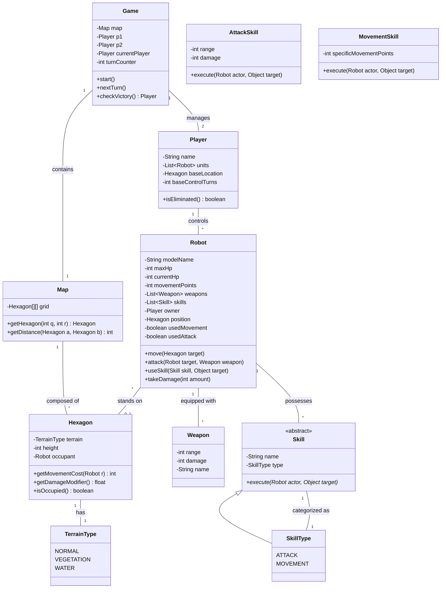

# Diagrama de Clases UML - DAW1

A continuación se presenta una propuesta inicial del diagrama de clases para el prototipo **Devastation Ai Wars 1 (DAW1)**, basado en los requerimientos del GDD.

## Notas de Diseño:

1.  **Game**: Centraliza la lógica de turnos y victoria.
2.  **Hexagon**: Gestiona el coste de movimiento y modificadores de daño según el terreno (`TerrainType`) y la altura.
3.  **Robot**: Es la entidad principal. Mantiene el estado de sus acciones (movimiento/ataque) por turno.
4.  **Skills**: Se utiliza herencia para diferenciar habilidades de ataque y movimiento, permitiendo extenderlas fácilmente para efectos especiales (OMSI).
5.  **Multiplicidad**: Un `Hexagon` puede estar ocupado por un `Robot` o ninguno.
