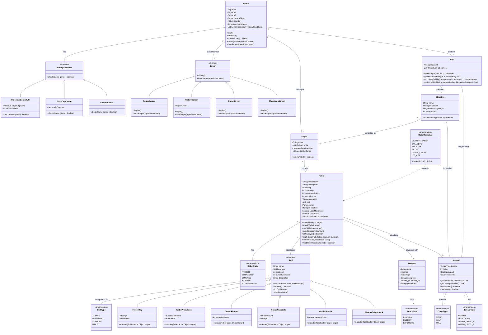

# Diagrama de Clases UML - DAW1

A continuación se presenta el diagrama de clases para el prototipo **Devastation Ai Wars 1 (DAW1)**, actualizado según el GDD.

## Notas de Diseño:

1.  **Game**: Centraliza la lógica de turnos, victoria y gestión de pantallas. Ahora incluye una referencia a la `currentScreen` y una lista de `VictoryCondition` para permitir múltiples condiciones de victoria.
2.  **Map**: Gestiona la cuadrícula de hexágonos, los objetivos del mapa y añade métodos para calcular visibilidad y modificadores de cobertura.
3.  **Hexagon**: Incluye `height` y `cover` (`CoverType`) para cálculos de visibilidad y daño. `TerrainType` ahora distingue niveles de agua.
4.  **TerrainType**: Enumeración actualizada para incluir `WATER_LEVEL_1` y `WATER_LEVEL_2` según el GDD.
5.  **CoverType**: Nueva enumeración para definir los tipos de cobertura que un hexágono puede ofrecer (`NONE`, `HALF`, `FULL`).
6.  **Player**: Sin cambios significativos, sigue gestionando las unidades y la base.
7.  **Robot**: Entidad principal. Se añade `actionPoints` para acciones secundarias, y un `Set<RobotState>` para gestionar los estados activos (como `FROZEN`, `EXHAUSTED`). Métodos para aplicar y remover estados.
8.  **RobotState**: Nueva enumeración para representar los estados que un robot puede tener.
9.  **RobotTemplate**: Enumeración que actúa como fábrica para instanciar objetos `Robot` con sus estadísticas predefinidas.
10. **Weapon**: Se añade `attackType` (físico, energía, explosivo) y `specialEffect` para mayor detalle.
11. **AttackType**: Nueva enumeración para clasificar los tipos de ataque de las armas.
12. **Skill**: Clase abstracta con `cooldown`, `currentCooldown`, `description`. Se añaden subclases concretas para representar las habilidades de los robots del GDD, con atributos específicos para cada una.
    *   `PlasmaSaberAttack` (Victory Saber)
    *   `GuidedMissile` (Bullseye)
    *   `RepairNanobots` (Bulwark)
    *   `JetpackBoost` (Scout)
    *   `TurboPropulsion` (Death Knight)
    *   `FreezeRay` (Ice Age)
13. **SkillType**: Enumeración para categorizar las habilidades (ataque, movimiento, soporte, utilidad).
14. **Screen**: Clase abstracta para la interfaz de usuario.
15. **MainMenuScreen, GameScreen, VictoryScreen, PauseScreen**: Clases concretas que implementan la interfaz de usuario para las diferentes fases del juego.
16. **VictoryCondition**: Clase abstracta para definir las condiciones de victoria.
17. **EliminationVC, BaseCaptureVC, ObjectiveControlVC**: Clases concretas que implementan las condiciones de victoria. `BaseCaptureVC` y `ObjectiveControlVC` incluyen `turnsToCapture`/`turnsToControl`.
18. **Objective**: Nueva clase para representar objetivos en el mapa que pueden ser capturados o controlados por los jugadores.

**Relaciones Adicionales:**
*   `Game` ahora tiene una relación con `Screen` y `VictoryCondition`.
*   `Map` tiene una relación con `Objective`.
*   `Hexagon` tiene una relación con `CoverType`.
*   `Robot` tiene una relación con `RobotState`.
*   `Weapon` tiene una relación con `AttackType`.
*   `Objective` tiene relaciones con `Hexagon` y `Player`.
