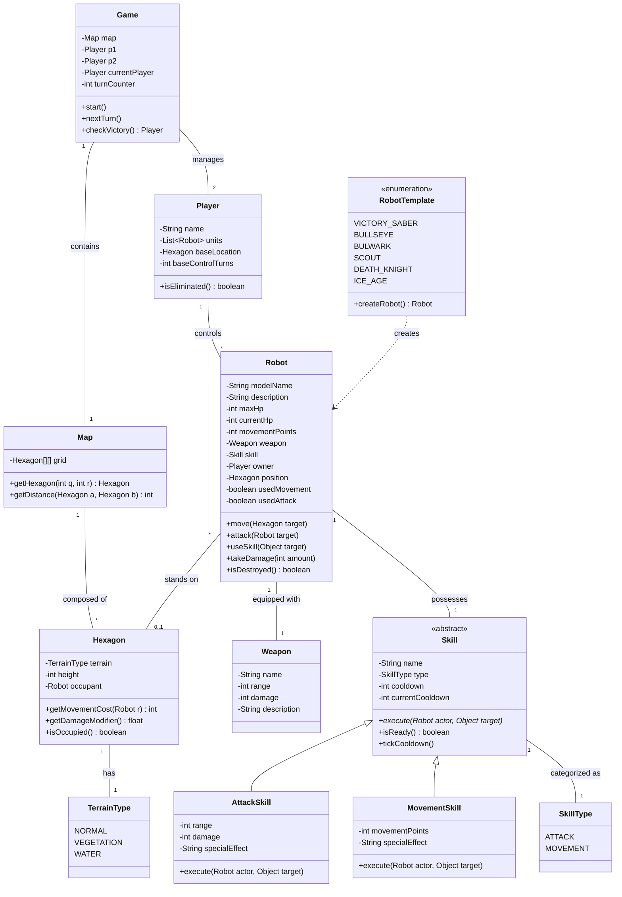

# Diagrama de Clases UML - DAW1

A continuación se presenta el diagrama de clases para el prototipo **Devastation Ai Wars 1 (DAW1)**, actualizado según el GDD.

## Notas de Diseño:

1. **Game**: Centraliza la lógica de turnos y victoria.
2. **Hexagon**: Gestiona el coste de movimiento y modificadores de daño según el terreno (`TerrainType`) y la altura.
3. **Robot**: Entidad principal. Según el GDD, cada robot tiene exactamente **1 arma** y **1 skill**. Se añade el campo `description` para el lore del robot.
4. **RobotTemplate**: Nueva enumeración que representa las **6 plantillas de robots** definidas en el GDD:
   - *Victory Saber* (HP 12, Mov 4, Sable de plasma)
   - *Bullseye* (HP 6, Mov 5, Misiles teledirigidos)
   - *Bulwark* (HP 15, Mov 4, Nanobots reparadores)
   - *Scout* (HP 7, Mov 5, Retropropulsores)
   - *Death Knight* (HP 13, Mov 3, Turbo propulsores)
   - *Ice Age* (HP 10, Mov 4, Rayo congelador)
   
   Actúa como fábrica (`Factory`) para instanciar objetos `Robot` con sus estadísticas predefinidas.
5. **Skill**: Se añaden `cooldown` y `currentCooldown` para gestionar la recarga entre turnos, y `specialEffect` en las subclases para describir los efectos especiales de cada skill (ignorar visibilidad, recuperar HP, inmovilizar, etc.).
6. **Weapon**: Se añade el campo `description` para el lore del arma.
7. **Corrección**: La relación `Skill <|-- SkillType` del diagrama anterior era **incorrecta** (implicaba que `SkillType` hereda de `Skill`). `SkillType` es una enumeración asociada a `Skill`, no una subclase. Corregido a `Skill "1" -- "1" SkillType`.
