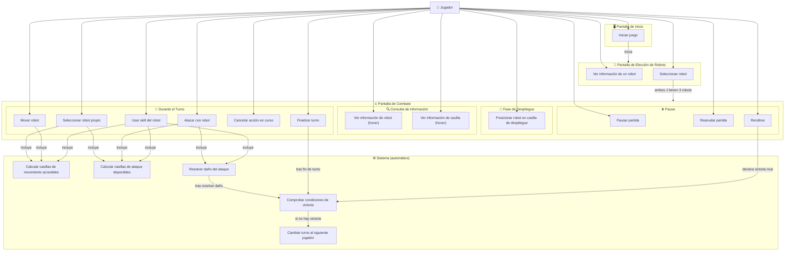

# Diagrama de Casos de Uso - DAW1

Diagrama de casos de uso principal del juego **Devastation Ai Wars 1 (DAW1)**, basado en el GDD.

> **Actores**: El único actor humano del sistema es el **Jugador** (J1 y J2 tienen el mismo rol, por lo que se unifican en un único actor). El **Sistema** actúa como actor secundario en los casos de uso de resolución automática.

